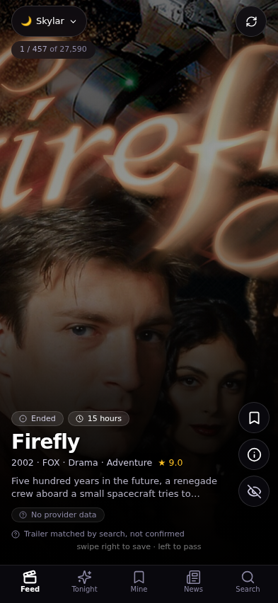
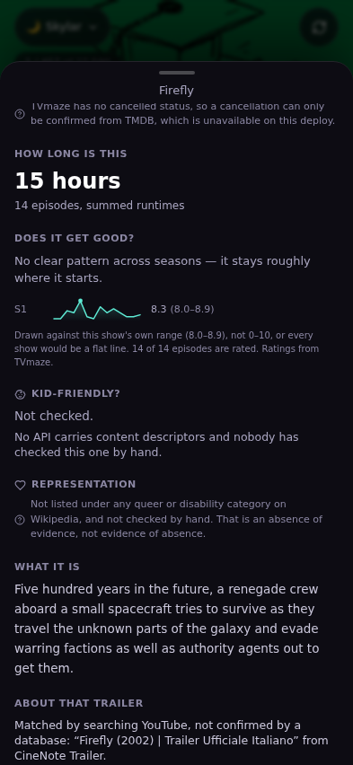
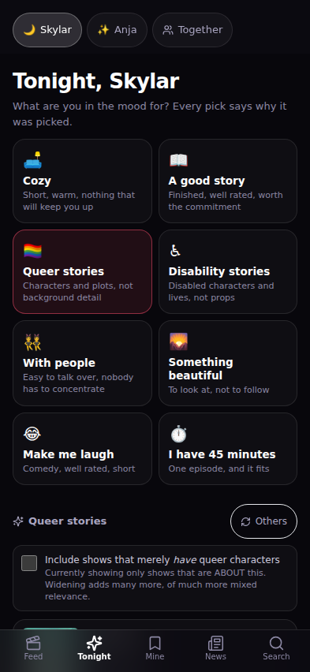
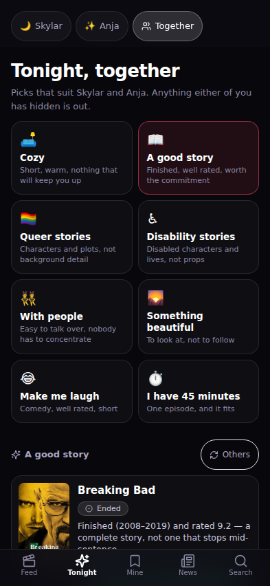
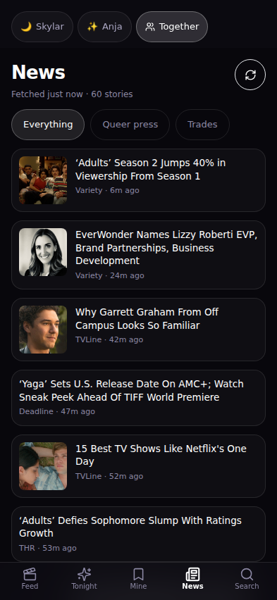
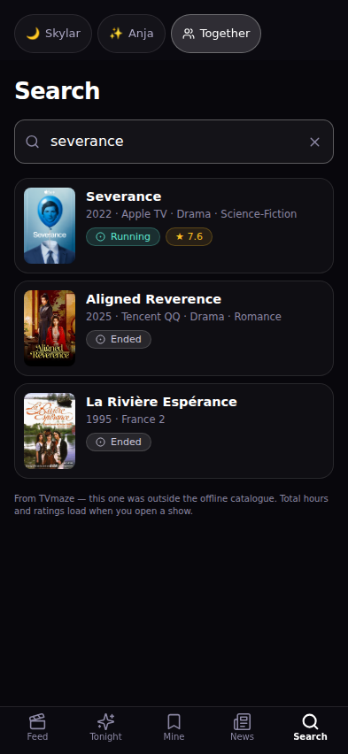
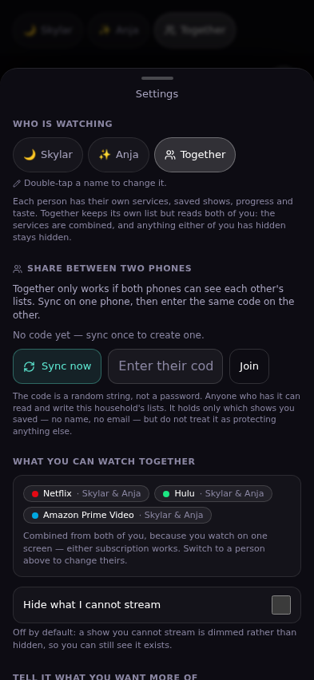
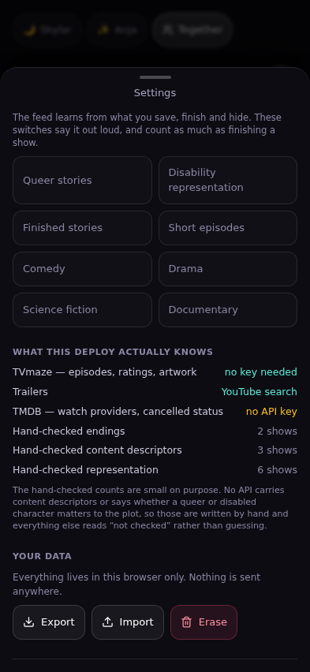
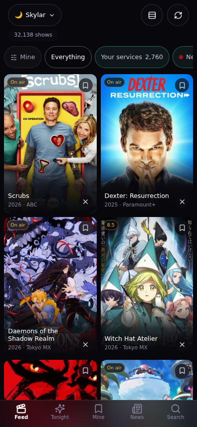
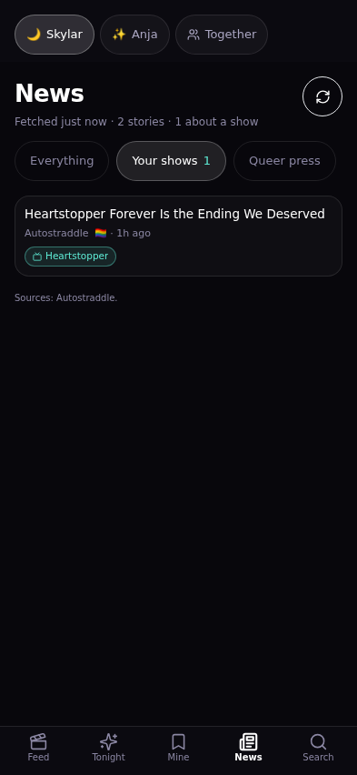

# Tonight

A personal TV catalog for deciding what to watch. One user, one phone,
installable on an iPhone home screen.

Netflix, Hulu and Prime are all good at showing you things and bad at helping
you choose. This is only the choosing part.



## What it answers

| Question | How |
|---|---|
| **Where can I actually watch it?** | Provider logos filtered to the services you pay for. Only `flatrate` counts — buy and rent are listed separately, never as "you can watch this". |
| **Is it finished?** | Running / Ended / Cancelled, with a warning when a stopped show probably does not resolve. See [the caveats](docs/DATA-SOURCES.md#2-nothing-knows-whether-a-show-ends-on-a-cliffhanger). |
| **How long is this?** | Total hours from summed per-episode runtimes. "62 hours" beats "5 seasons". |
| **Does it get good, and when?** | Per-season sparklines from per-episode ratings: *"Season 1 starts slow and clicks at episode 5"*, with the arithmetic behind it. |
| **Where am I in it?** | Episode tracker, next episode, next air date. Stored on the phone. |
| **What leaves soon?** | Provider sets are recorded and diffed, client-side on every lookup and nightly on the server. |
| **What tonight?** | Seven moods, each a predicate over real fields, each pick stating the reason it was picked. |
| **What next?** | Recommendations that name the show they came from. Never a bare score. |
| **Is it OK for a kid?** | Judged on content, not the certificate — and it says "not checked" when nobody has checked. |
| **Queer and disability representation** | First-class tags with a note on why each show qualifies. Hand-written, because no API can tell you whether a character matters to the plot. |
| **What is happening?** | 13 news feeds merged; seven are queer publications. |
| **Never show me this again** | One tap, gone from every list. |
| **Who is watching?** | Two people share one link. Each has their own services, saves, progress, hidden shows and learned taste, plus a Together mode for deciding as a pair. |

## Screens

| Feed | Detail | Tonight | Together |
|---|---|---|---|
|  |  |  |  |

| News | Search | Profiles & sync | Taste |
|---|---|---|---|
|  |  |  |  |

| Grid | News about your shows |
|---|---|
|  |  |

The feed is the good way to decide and a slow way to look, so there is a 2-up
grid behind the toggle in the header: six shows a screen instead of one, quick
save and hide on each tile, and tapping one drops you into the feed on that
show. It costs nothing to scroll, because a tile needs only the poster that is
already in the baked catalogue row, while a feed card needs a backdrop and a
trailer.

## Two people, one link

Skylar and Anja each get their own space. **Together** is not a third person:
it keeps its own list, but reads both of you for filtering — services are the
union, because you watch on one screen and either subscription works, and
anything either of you has hidden stays hidden.

The feed is ordered by a taste model learned from what each person does:
finished +3, saved +2, started +1, hidden −3, over the features the data
actually has (genre, runtime band, era, network, status, and the hand-checked
representation tags). It never shows a score. Every weight traces back to the
shows that produced it:

> *drama and science-fiction — like Dark and Severance*
>
> *Skylar likes drama, and Anja likes queer stories.*

Below a handful of signals it labels itself as guessing.

**Sync** between two phones is a household code plus a Netlify Blobs document,
merged last-write-wins per profile. The code is obscurity, not security, and
Settings says so in those words.

## Trailers with no API key

Every card autoplays a trailer whether or not TMDB is configured.
`/api/trailer` tries TMDB, then falls back to a scored YouTube search —
12 of 13 test shows resolved the correct official trailer and the 13th
correctly refused rather than guessing. A searched match is labelled as one.
See [the caveats](docs/DATA-SOURCES.md#trailers-without-a-key).

## The rule this is built on

**Verify before you claim.** Every endpoint was called and printed before
anything was built on it. Three planned features had to change because the data
does not exist, and one turned out better than planned. That is all written
down in **[docs/DATA-SOURCES.md](docs/DATA-SOURCES.md)**.

The corollary is that the app never renders a confident blank. If a trailer,
a provider list, a content check or an ending is unknown, it says which, and
why.

## Running it

```bash
cd catalog
npm install
npm run dev              # http://localhost:5173
```

Works with no keys at all — TVmaze needs none, and it carries episodes,
ratings, air dates and 4K backdrops. TMDB adds trailers, watch providers and
the Cancelled status.

```bash
npm run verify           # call every source, print real rows
npm run verify:tmdb      # same, including TMDB (needs TMDB_API_KEY)
npm run build
npm run shots            # drive it in an iPhone viewport, capture screenshots
npm test                 # curated ids, service worker, trailers, interactions
node scripts/test-sw.mjs         # the service worker's four caching rules
node scripts/test-trailer.mjs    # trailer resolution against live YouTube
node scripts/check-curated.mjs   # every hand-written note points at the right show
```

## Deploying to Netlify

This repo also hosts a separate app at its root, so set the **base directory**
rather than adding a root config:

1. New site from this repo.
2. **Base directory:** `catalog` — Netlify then reads `catalog/netlify.toml`,
   which sets the build command, publish dir and functions dir.
3. **Environment variables:** `TMDB_API_KEY` (optional but wanted).
4. Deploy.

The nightly `availability-snapshot` function is scheduled in `netlify.toml` and
no-ops safely without a key.

## How it is put together

```
catalog/
  netlify/functions/
    trailer.js                TMDB first, scored YouTube search as fallback
    household.js              sync between the two phones
    tmdb.js                   TMDB proxy — key stays server-side, named ops only
    news.js                   merges 13 RSS feeds, reports per-source failures
    availability-snapshot.js  nightly provider diff → "leaving soon"
  src/
    lib/
      api.js        one fetch wrapper; every response carries its age
      tvmaze.js     the backbone, no key
      tmdb.js       optional; degrades to {available:false} rather than throwing
      derive.js     hours, season stats, turning points, cliffhanger risk
      moods.js      each mood is a predicate that returns its own reason
      recommend.js  explainable similarity; no bare scores
      kidsafe.js    content-based verdict with an explicit "not checked"
      providers.js  service matching, with aliases so nothing is wrongly hidden
      store.js      profiles, localStorage, exportable
    data/
      curated.js    hand-checked endings, content and representation
      feeds.js      the news sources, each one verified
  scripts/
    verify-sources.mjs  call everything, print real rows, name missing fields
    check-curated.mjs   prove every annotation points at the show it names
    prove-diff.mjs      prove a data rewrite changed only what it declared
    shots.mjs           iPhone viewport screenshots + tap-target/zoom checks
    test-sw.mjs         service worker caching rules
```

### The service worker

Two caches, two deliberately different strategies:

- **Assets — cache-first.** Safe *only* because Vite content-hashes every
  filename, so a cached copy can never be the wrong copy.
- **API — network-first**, 3.5s timeout, cache as fallback, hard 3-day expiry.
  Not stale-while-revalidate. A stale-first API cache with no expiry pins the
  app to old data and makes every refresh button a lie.

Every cached response is stamped with `x-sw-cached-at`, so the UI can always say
*"cached 2h ago"* instead of quietly pretending to be live. A 5xx carrying a
real message is passed through rather than replaced with a synthetic "offline" —
that bug hid the app's own "TMDB key not set" behind a generic network error.

### iPhone specifics

- Inputs are **16px** on touch. Anything smaller and Safari zooms on focus and
  never zooms back. Asserted in `scripts/shots.mjs`.
- `viewport-fit=cover` plus `env(safe-area-inset-*)` throughout.
- **44pt minimum** tap targets, asserted in the screenshot run (currently 0
  violations).
- Primary navigation is a **bottom bar**. A 390pt screen cannot hold a wordmark,
  a search field and four icons in one row.
- Layout switches on **`@media (pointer: coarse)`**, not width. A phone in
  landscape is 844px across and still has no cursor.
- Detail views are **bottom sheets** with a grab handle and drag-to-dismiss,
  scrolling inside the sheet with `overscroll-behavior: contain` so the page
  behind does not rubber-band. A downward drag only dismisses from the top of
  the scroll, or scrolling up would throw the sheet away.

### The feed

Full-screen scroll-snap (`y mandatory` + `scroll-snap-stop: always`, verified to
land exactly on card boundaries). The active card is computed from the scroll
offset rather than observed, because scroll-snap makes the index exact
arithmetic; only that card mounts a trailer and leaving it destroys the player,
so a long scroll never leaves a stack of decoding videos behind.

Swiping a card sideways while the feed scrolls vertically needs an axis lock,
and the lock has to have a margin. Deciding by `|dx| > |dy|` makes (10, 9) a
swipe and (9, 10) a scroll, and those are the same flick: an axis has to win by
a margin, anything in the wedge between the two cones stays undecided, and a
gesture that never resolves goes to the browser. `scripts/test-swipe.mjs` sweeps
0 to 90 degrees and asserts the boundary is a single clean crossing, because a
lock decided by pixel luck gives a scattered pattern and scattered is what
finicky feels like in the hand.

Trailers are YouTube IFrame embeds because TMDB gives YouTube keys and YouTube's
terms require their player. `mute=1` and `playsinline=1` are requirements, not
style: iOS permits inline autoplay only when muted. Tap the speaker to unmute.
The backdrop always renders underneath, so a slow, blocked or missing embed
degrades to a still rather than a black box.

## Attribution

This product uses the TMDB API but is not endorsed or certified by TMDB.
Streaming availability is provided by JustWatch through TMDB.
Episode data, ratings and artwork from TVmaze.
